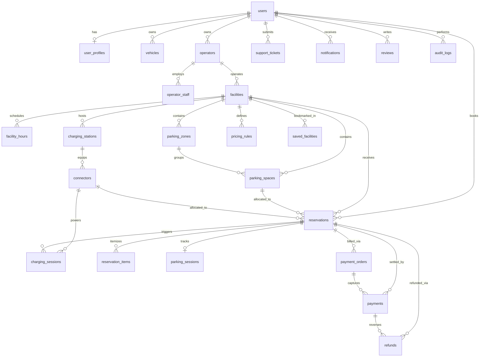

# Entity-Relationship Diagram (PostgreSQL Schema)

28 normalized PostgreSQL tables defined in `src/db/schema.ts` and `src/db/migrations/0001_init.sql`.

```mermaid
erDiagram
    users ||--o| user_profiles : has
    users ||--o{ vehicles : owns
    users ||--o{ operators : owns
    users ||--o{ reservations : books
    users ||--o{ support_tickets : submits
    users ||--o{ notifications : receives
    users ||--o{ reviews : writes
    users ||--o{ audit_logs : performs

    operators ||--o{ operator_staff : employs
    operators ||--o{ facilities : operates

    facilities ||--o{ facility_hours : schedules
    facilities ||--o{ parking_zones : contains
    facilities ||--o{ parking_spaces : contains
    facilities ||--o{ charging_stations : hosts
    facilities ||--o{ pricing_rules : defines
    facilities ||--o{ reservations : receives
    facilities ||--o{ saved_facilities : bookmarked_in

    parking_zones ||--o{ parking_spaces : groups
    charging_stations ||--o{ connectors : equips

    parking_spaces ||--o{ reservations : allocated_to
    connectors ||--o{ reservations : allocated_to
    connectors ||--o{ charging_sessions : powers

    reservations ||--o{ reservation_items : itemizes
    reservations ||--o| parking_sessions : tracks
    reservations ||--o{ charging_sessions : triggers
    reservations ||--o{ payment_orders : billed_via
    reservations ||--o{ payments : settled_by
    reservations ||--o{ refunds : refunded_via

    payment_orders ||--o{ payments : captures
    payments ||--o{ refunds : reverses
```
